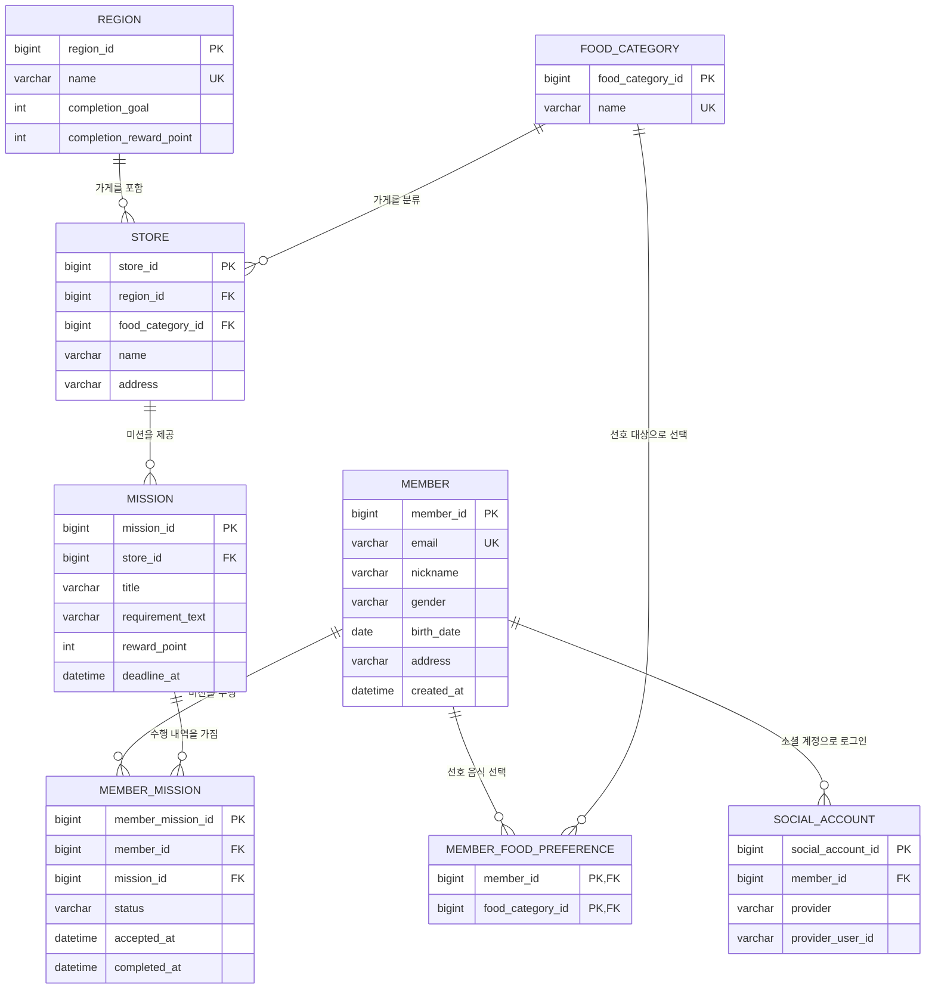

# UMC 맛집 미션 서비스 ERD

## 핵심 제약

- `SOCIAL_ACCOUNT(provider, provider_user_id)`는 유일해야 합니다.
- `MEMBER_MISSION(member_id, mission_id)`는 유일해야 합니다.
- `MEMBER_MISSION.status`는 `IN_PROGRESS` 또는 `COMPLETED`를 사용합니다.
- 회원은 선호 음식 카테고리를 최대 3개까지 선택합니다.
- 지역별 기본값은 `completion_goal = 10`, `completion_reward_point = 1000`입니다.
- 지도·검색, 포인트 내역, 알림 설정, 점포 관리, 리뷰 데이터는 이번 ERD에서 제외합니다.
